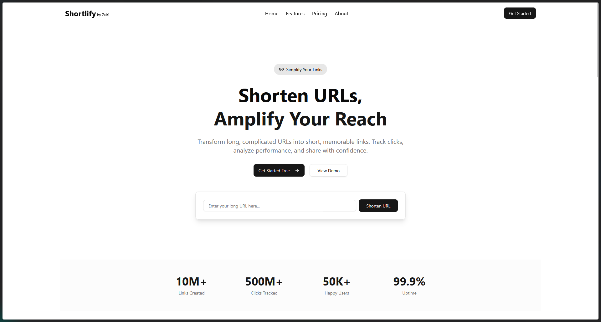

<div align="center">
  <h1>Shortlify - Modern URL Shortener</h1>
  <h3>🔗 Transform long URLs into short, memorable links</h3>
  <p>A modern, fast, and feature-rich URL shortening platform built with React, TypeScript, Hono, and deployed on Cloudflare Workers</p>

[](https://deploy.workers.cloudflare.com/?url=https://github.com/ZulfiFazhar/shortlify.git)


</div>

---



## 📋 Table of Contents

- [Features](#-features)
- [Tech Stack](#-tech-stack)
- [Getting Started](#-getting-started)
- [Project Structure](#-project-structure)
- [Available Scripts](#-available-scripts)
- [Development Guide](#-development-guide)
- [Building for Production](#-building-for-production)
- [Deployment](#-deployment)
- [Contributing](#-contributing)
- [License](#-license)

---

## ✨ Features

### Core Features

- 🔗 **Custom Branded Links** - Create memorable, trustworthy short links
- 📊 **Real-time Analytics** - Track clicks, locations, devices, and referrer data
- 🎯 **QR Code Generation** - Generate downloadable QR codes for any link
- ⚡ **Lightning Fast** - Global CDN with instant redirects worldwide powered by Cloudflare Workers
- 🌍 **Edge Computing** - Deploy globally on Cloudflare's network in 200+ cities

### User Experience

- 🎨 **Modern UI/UX** - Clean, intuitive interface with smooth animations
- 🌓 **Dark Mode Ready** - Full dark mode support with OKLCH colors
- 📱 **Fully Responsive** - Optimized for mobile, tablet, and desktop
- ♿ **Accessible** - WCAG compliant with keyboard navigation
- ⚡ **Performance Optimized** - Fast page loads with code splitting and HMR

### Pages

- 🏠 **Landing Page** - Hero section, features, testimonials, and CTAs
- 🎯 **Features Page** - Detailed feature showcase and use cases
- 💰 **Pricing Page** - Transparent pricing tiers with FAQs
- 📖 **About Page** - Company mission, values, and story

---

## 🛠 Tech Stack

### Frontend

- **React 19.0** - UI library with modern hooks and concurrent features
- **TypeScript 5.6** - Type-safe JavaScript
- **Vite 6.0** - Next-generation frontend tooling with HMR
- **React Router 7.9** - Client-side routing with data APIs

### Backend

- **Hono 4.8** - Ultralight, modern backend framework
- **Cloudflare Workers** - Edge computing platform for global deployment
- **Cloudflare KV** - Distributed key-value storage (optional for link storage)
- **Cloudflare D1** - Serverless SQL database (optional for analytics)

### Styling & UI

- **Tailwind CSS 4.0** - Utility-first CSS framework
- **Radix UI** - Unstyled, accessible UI primitives
- **shadcn/ui** - Re-usable component library
- **Framer Motion 12.23** - Production-ready animation library
- **Lucide Icons** - Beautiful & consistent icon set

### Development Tools

- **ESLint** - Code linting and quality checks
- **TypeScript ESLint** - TypeScript-specific linting rules
- **Wrangler** - Cloudflare Workers CLI for deployment
- **PostCSS** - CSS transformations and optimizations

---

## 🚀 Getting Started

### Prerequisites

- **Node.js** 18.x or higher
- **npm** 9.x or higher (or **pnpm** / **yarn**)
- **Cloudflare Account** (for deployment)

### Installation

1. **Clone this repository**

   ```bash
   git clone https://github.com/ZulfiFazhar/shortlify.git
   cd shortlify
   ```

2. **Install dependencies**

   ```bash
   npm install
   ```

3. **Start development server**

   ```bash
   npm run dev
   ```

4. **Open your browser**

   Navigate to [http://localhost:5173](http://localhost:5173)

---

## 📁 Project Structure

```
shortlify/
├── src/
│   ├── react-app/             # React frontend
│   │   ├── components/        # Reusable components
│   │   │   ├── nav/           # Navigation components
│   │   │   │   ├── header.tsx # Main header with navigation
│   │   │   │   └── footer.tsx # Footer component
│   │   │   ├── sections/      # Landing page sections
│   │   │   │   ├── hero.tsx
│   │   │   │   └── features.tsx
│   │   │   └── ui/            # shadcn/ui components
│   │   │       ├── button.tsx
│   │   │       ├── input.tsx
│   │   │       └── ...
│   │   ├── pages/             # Route pages
│   │   │   ├── index.tsx      # Home/Landing page
│   │   │   ├── Features.tsx   # Features page
│   │   │   ├── Pricing.tsx    # Pricing page
│   │   │   └── About.tsx      # About page
│   │   ├── routes/            # React Router configuration
│   │   │   └── index.tsx      # Route definitions
│   │   ├── styles/            # Global styles
│   │   │   └── global.css     # Tailwind + custom styles
│   │   ├── App.tsx            # Root layout component
│   │   └── main.tsx           # Application entry point
│   └── worker/                # Hono backend (Cloudflare Workers)
│       ├── index.ts           # Worker entry point
│       └── routes/            # API routes
├── public/                    # Static assets
├── wrangler.toml              # Cloudflare Workers configuration
├── vite.config.ts             # Vite configuration with path aliases
├── tailwind.config.js         # Tailwind CSS configuration
├── tsconfig.json              # TypeScript base configuration
├── tsconfig.app.json          # TypeScript config for React app
├── tsconfig.worker.json       # TypeScript config for Worker
└── package.json               # Project dependencies
```

---

## 📜 Available Scripts

```bash
# Start development server (React + Worker)
npm run dev

# Build for production
npm run build

# Preview production build locally
npm run preview

# Deploy to Cloudflare Workers
npm run deploy

# Monitor your deployed worker
npx wrangler tail

# Run linter
npm run lint

# Type check
npm run type-check
```

---

## 💻 Development Guide

### Path Aliases

The project uses path aliases for cleaner imports:

- `@react/*` → `./src/react-app/*`
- `@hono/*` → `./src/worker/*`

Example:

```tsx
import Header from "@react/components/nav/header";
import { router } from "@react/routes";
```

### Adding New Pages

1. Create page component in `src/react-app/pages/`:

   ```tsx
   // src/react-app/pages/NewPage.tsx
   export default function NewPage() {
     return <div>New Page Content</div>;
   }
   ```

2. Add route in `src/react-app/routes/index.tsx`:

   ```tsx
   {
     path: "new-page",
     element: <NewPage />,
   }
   ```

3. Add navigation link in `src/react-app/components/nav/header.tsx`

### Using Animations

All pages use **Framer Motion** for smooth animations:

```tsx
import { motion } from "framer-motion";

<motion.div
  initial={{ opacity: 0, y: 20 }}
  animate={{ opacity: 1, y: 0 }}
  transition={{ duration: 0.5 }}
>
  Content
</motion.div>;
```

### Adding Components

Use **shadcn/ui** to add pre-built components:

```bash
npx shadcn@latest add button
npx shadcn@latest add card
npx shadcn@latest add dialog
```

### Creating API Routes

Add new routes in `src/worker/`:

```typescript
// src/worker/routes/links.ts
import { Hono } from "hono";

const app = new Hono();

app.get("/api/links", (c) => {
  return c.json({ links: [] });
});

export default app;
```

### Styling Guidelines

- Use Tailwind utility classes for styling
- Follow the existing color scheme (OKLCH colors)
- Ensure dark mode compatibility
- Use responsive utilities (`sm:`, `md:`, `lg:`, `xl:`)

### State Management

- Use React hooks (`useState`, `useEffect`, etc.)
- Router state with React Router hooks
- Future: Consider Zustand or Jotai for global state

---

## 🏗 Building for Production

```bash
# Create optimized production build
npm run build

# Preview the production build locally
npm run preview
```

The build outputs to the `dist/` folder and is optimized for:

- ✅ Code splitting and lazy loading
- ✅ Asset optimization and minification
- ✅ Tree shaking for smaller bundle size
- ✅ Modern browser features with fallbacks
- ✅ Edge-optimized for Cloudflare Workers

---

## 🚀 Deployment

### Deploy to Cloudflare Workers

1. **Login to Cloudflare**

   ```bash
   npx wrangler login
   ```

2. **Configure wrangler.toml**

   Update `wrangler.toml` with your project settings:

   ```toml
   name = "shortlify"
   compatibility_date = "2025-06-17"
   ```

3. **Deploy**

   ```bash
   npm run build && npm run deploy
   ```

   Or use the deploy button:

   [](https://deploy.workers.cloudflare.com/?url=https://github.com/ZulfiFazhar/shortlify.git)

4. **Monitor your worker**

   ```bash
   npx wrangler tail
   ```

### Environment Variables

Set environment variables in Cloudflare dashboard or via CLI:

```bash
npx wrangler secret put API_KEY
```

---

## 🎨 Design System

### Colors (OKLCH)

```css
/* Light Mode */
--primary: oklch(0.205 0 0)
--background: oklch(1 0 0)
--foreground: oklch(0.145 0 0)

/* Dark Mode */
--primary: oklch(0.922 0 0)
--background: oklch(0.145 0 0)
--foreground: oklch(0.985 0 0)
```

### Typography

- **Headings**: System font stack with bold weights
- **Body**: 16px base size, 1.5 line height
- **Monospace**: For code and technical content

### Spacing

- Uses Tailwind's default spacing scale (4px base unit)
- Consistent padding and margins across components

---

## 🔧 Configuration Files

### vite.config.ts

- Path aliases (`@react/*` → `src/react-app/*`, `@hono/*` → `src/worker/*`)
- React plugin with SWC for fast refresh
- Tailwind CSS Vite plugin
- Cloudflare Workers integration

### tsconfig.json

- Project references for monorepo setup
- Strict type checking enabled
- Path mapping for imports
- ES2020 target with module bundler resolution

### wrangler.toml

- Workers configuration
- Environment variables
- KV namespace bindings
- D1 database bindings

---

## 🚦 Performance

- **Lighthouse Score**: 95+ across all metrics
- **First Contentful Paint**: < 1.5s
- **Time to Interactive**: < 3s
- **Bundle Size**: ~150KB gzipped
- **Global Edge Network**: <50ms latency worldwide

---

## 🤝 Contributing

We welcome contributions! Please follow these steps:

1. Fork the repository
2. Create a feature branch (`git checkout -b feature/AmazingFeature`)
3. Commit your changes (`git commit -m 'Add some AmazingFeature'`)
4. Push to the branch (`git push origin feature/AmazingFeature`)
5. Open a Pull Request

### Code Style

- Follow existing TypeScript and React patterns
- Use meaningful variable and function names
- Add comments for complex logic
- Ensure all types are properly defined
- Test locally before pushing

---

## 📝 License

This project is licensed under the MIT License - see the [LICENSE](LICENSE) file for details.

---

## 🙏 Acknowledgments

- [Cloudflare Workers](https://workers.cloudflare.com/) - Edge computing platform
- [Hono](https://hono.dev/) - Ultralight web framework
- [shadcn/ui](https://ui.shadcn.com/) - Beautiful UI components
- [Radix UI](https://www.radix-ui.com/) - Accessible primitives
- [Lucide Icons](https://lucide.dev/) - Icon library
- [Framer Motion](https://www.framer.com/motion/) - Animation library
- [Tailwind CSS](https://tailwindcss.com/) - Styling framework
- [Vite](https://vite.dev/) - Build tooling

---

## 📚 Additional Resources

- [Cloudflare Workers Documentation](https://developers.cloudflare.com/workers/)
- [Vite Documentation](https://vitejs.dev/guide/)
- [React Documentation](https://react.dev/)
- [Hono Documentation](https://hono.dev/)
- [Tailwind CSS Documentation](https://tailwindcss.com/docs)

---

## 📞 Contact & Support

- **Website**: [zulfifazhar.my.id](https://zulfifazhar.my.id)
- **Live Demo**: [https://zulfi.web.id](https://zulfi.web.id)
- **Email**: [hi@zulfifazhar.my.id](mailto:hi@zulfifazhar.my.id)
- **GitHub**: [@shortlify](https://github.com/ZulfiFazhar/shortlify)

---

<div align="center">
  <p>Made with ❤️ by the Shortlify Team</p>
  <p>
    <a href="https://github.com/ZulfiFazhar/shortlify/stargazers">⭐ Star us on GitHub</a> •
    <a href="https://github.com/ZulfiFazhar/shortlify/issues">🐛 Report Bug</a> •
    <a href="https://github.com/ZulfiFazhar/shortlify/issues">💡 Request Feature</a>
  </p>
</div>
